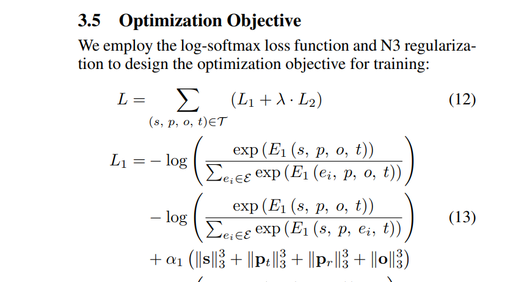
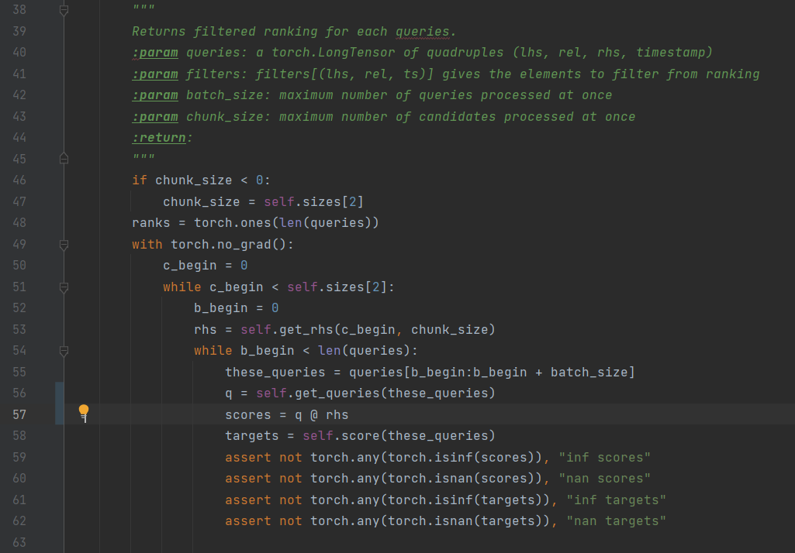
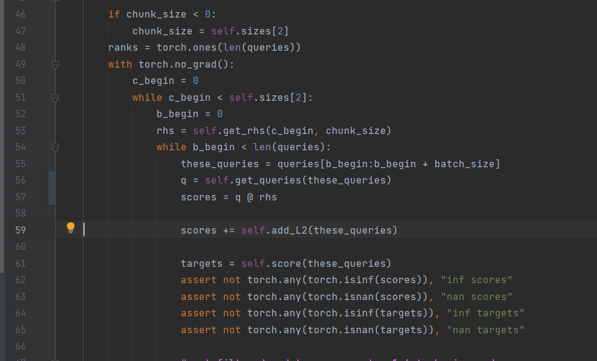
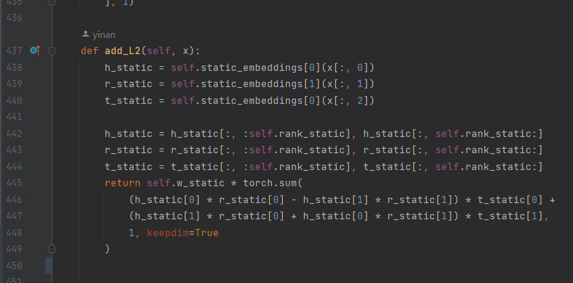

# Replace the original files with the updated versions of model_cs.py and model_lcge.py, which fix existing problems. Other files remain as original.

## Original model_lcge.py, model_cs.py: 
'get_queries' function from both file in  **LCGE** are missing a **λL2** term accodring to Equation (12) from '
Logic and Commonsense-Guided Temporal Knowledge Graph Completion'.

## Modified model_lcge.py, model_cs.py: 
Fix this issue by add an 'add_L2' function, and call 'add_L2' function in 'get_ranking' at line 59 in model_lcge.py and line 56 in model_cs.py.

